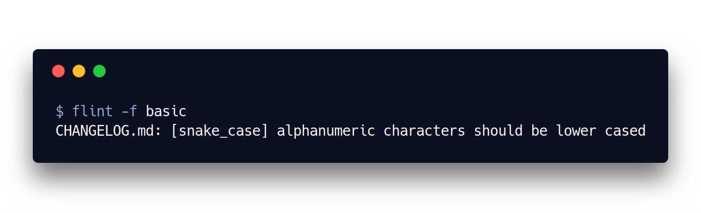
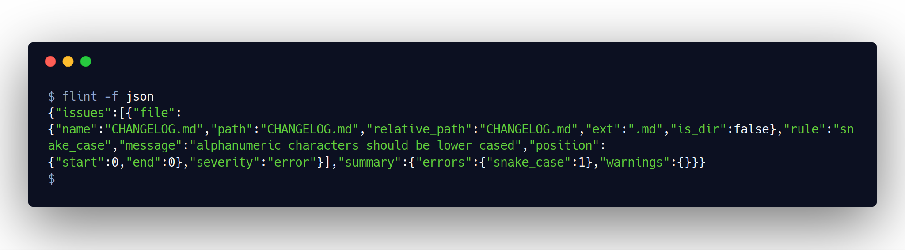
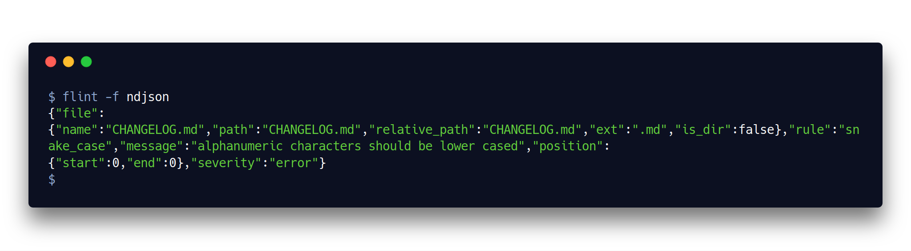

# Flint

[](https://godoc.org/github.com/astrocorp42/flint)
[](https://github.com/astrocorp42/flint/releases/latest)
[](https://travis-ci.org/astrocorp42/flint)

You think there is no place in code reviews to discuss about files naming conventions ? Impose consistent files and directories naming rules with flint: the filesystem linter.

1. [Installation](#installation)
2. [Usage](#usage)
3. [Configuration](#configuration)
4. [Available rules](#available-rules)
5. [Available formatters](#available-formatters)
6. [Roadmap](#roadmap)

-------------------

## Installation

### Using go (nightly)
```bash
$ go get -u github.com/astrocorp42/flint
```

### Binary releases
[https://github.com/astrocorp42/flint/releases/latest](https://github.com/astrocorp42/flint/releases/latest)


## Usage

Go to your project's root directory then
```bash
$ flint init # create a configuration file with default configuration
$ flint
# or cd my_directory && flint to lint only current directory and subfiles
```


## Configuration

Configuration is stored in a `.flint.(toml|json)` file at the root of your project (repo).

When runned, flint will recursively search upward for a configuraiton file, starting in the current
directory.

```bash
$ cat .flint.toml
```

```toml
# as json does not allow comments, you can use "comment" field everywhere
comment = "This is a configuration file for flint, the filesystem linter. More information here: https://github.com/astrocorp42/flint"
format = "default" # valid values are [default]
severity = "warning" # valid values are [off, warning, error]
error_code = 1
warning_code = 0
match_format = "blob" # match format for ignore_directories and ignore_files, valid values are [blob, regexp]


# you can ignore files and directories using glob or regexp syntax according to the configuration above
ignore_files = [".*", "vendor", "Gopkg.toml", "Gopkg.lock", "README.md", "LICENSE"]
ignore_directories = [".*", "vendor"]


# define used rules
[rules]
  [rules."dir/no_dot"]
  [rules."file/lower_case_ext"]
  [rules."file/no_multi_ext"]
  [rules.no_empty_name]
  [rules.no_leading_underscores]
  [rules.no_trailing_underscores]
  [rules.no_whitespaces]
  [rules.snake_case]
```


## Available rules

| Name                  | Description                                                              |
| --------------------- | :----------------------------------------------------------------------- |
| `dir/no_dot`          | Disallows the usage of `.` in directory names.                           |
| `file/lower_case_ext` | Files names hould be lower cased.                                        |
| `file/no_multi_ext`   | Disallows usage of multiple extensions in file names (eg. main.text.js). |
| `no_empty_name`       | Disallows usage of names which only contains whitespaces.                |
| `no_leading_underscores` | Disallows usage of leading underscores in names.                      |
| `no_trailing_underscores` | Disallows usage of trailing underscores in names.                    |
| `no_whitespaces`      | Disallows usage of whitespaces in names.                                 |
| `snake_case`          | Force names to respect the `snake case` convention (only lower cased alphanum and underscores). |


## Available formatters


### Console


### Basic



### Json



### Ndjson



## Roadmap

See [https://github.com/astrocorp42/flint/projects/1](https://github.com/astrocorp42/flint/projects/1)
